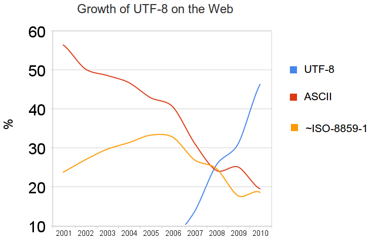

#107.3 Localisation and internationalisation
*Weight: 3*

Candidates should be able to localise a system in a different language than English. As well, an understanding of why LANG=C is useful when scripting.

## Key Knowledge Areas
- Configure locale settings and environment variables.
- Configure timezone settings and environment variables.

## Terms and Utilities
- /etc/timezone
- /etc/localtime
- /usr/share/zoneinfo/
- LC_*
- LC_ALL
- LANG
- TZ
- /usr/bin/locale
- tzselect
- timedatectl
- date
- iconv
- UTF-8
- ISO-8859
- ASCII
- Unicode

## timezone
On linux systems you can use `date` and `cal` commands to check the date and the calendar. It is possible to print a custom date using `+` formatter:

````
[jadi@funlife ~]$ date +'%Y%m%d-%M'
20160103-39
[jadi@funlife ~]$ date +'%Y%m%d-%H%M'
20160103-2239
````


Timezone determines what is your time difference comparing with a reference timezone. This way you can talk about times regardless from your location. In another words, I can tell you "start the change request at 02:30 UTC" we both know when the change will be started in our own timezone (mine is 02:30 minus 3:30).

You can configure your timezone while installing the system or by using a GUI in the system settings. It is even possible to set the timezone by clicking or right-clicking on the date and time on your panel. But as always there is a command line way. The old one used to be ````tzconfig```` but it is not used anymore.

Different distros do have their own configuration commands, a general one is:


````
tzselect 
Please identify a location so that time zone rules can be set correctly.
Please select a continent, ocean, "coord", or "TZ".
 1) Africa
 2) Americas
 3) Antarctica
 4) Arctic Ocean
 5) Asia
 6) Atlantic Ocean
 7) Australia
 8) Europe
 9) Indian Ocean
10) Pacific Ocean
11) coord - I want to use geographical coordinates.
12) TZ - I want to specify the time zone using the Posix TZ format.
````

This process will suggest you to set a variable called ````TZ```` as follow to set *your own* time zone, but not the systems:

````
TZ='Asia/Tehran'; export TZ
````

## Configuring timezone
There is a directory at `/usr/share/zoneinfo/` containing all the timezone info. These are binary files. If you need to change your systems timezone you need to change 2 files:

````
cat /etc/timezone 
Asia/Tehran
````

and there is a short link at this place:

````
# ls -ltrh /etc/localtime 
-rw-r--r-- 1 root root 1.7K Jan  2 18:10 /etc/localtime
````
This file should be replaced by the correct file from `/usr/share/zoneinfo/`. It is nicer to make a symbolic link rather than copying the actual file. This will prevent the conflicts during next upgrades.

## Configuring Languages
You can check the status of current selected system language by issuing `locale`:

````
$locale
LANG=en_US.UTF-8
LANGUAGE=
LC_CTYPE="en_US.UTF-8"
LC_NUMERIC="en_US.UTF-8"
LC_TIME="en_US.UTF-8"
LC_COLLATE="en_US.UTF-8"
LC_MONETARY="en_US.UTF-8"
LC_MESSAGES="en_US.UTF-8"
LC_PAPER="en_US.UTF-8"
LC_NAME="en_US.UTF-8"
LC_ADDRESS="en_US.UTF-8"
LC_TELEPHONE="en_US.UTF-8"
LC_MEASUREMENT="en_US.UTF-8"
LC_IDENTIFICATION="en_US.UTF-8"
LC_ALL=
````

These are all environment variables telling system what languages to use. Here I'm using `LANG=en_US.UTF-8` which means I'm using English with US variant and UTF-8 encoding.

> UTF-8 and other encodings will be discussed a bit later in this chapter

Other variables tell the system how to show different things based on localisation systems. For example if we change the LC_TIME to "en_GB.UTF-8" the time will be printed in Great Britain format from that moment on.

Another important settings is `LC_ALL`. It can be used to change **ALL** settings. If you do a `export LC_ALL=fa_IR.UTF-8`, all the settings will be set to that one, with no exception. It is always possible to `unset LC_ALL`.

### LANG=C
Another important point to know is the `LANG=C` settings. This indicates two things:

1. All language settings will be default (en.US)
2. Binary sort order

It is also possible to do a LC_ALL=C.

### changing or adding locales
This is not a part of LPIC exam but it is good to know that on a debian based machine, you can change, add or set your default *locales* using `dpkg-reconfigure locales`.

## Character Encoding
### ACSII
Computers used to work with 7bit characters encoding. That would give us 128 characters which was enough for numbers, punctuation and digits!

### ISO-8859
It had more characters and a lots of sets for Thai, Arabic and other languages but still had ASCII character sets.

### UTF-8
The `Unicode Transformation Format` is the newest encoding method. It is  a real universal encoding with characters not only for all written languages but also for fun characters like  ¾, ♠, π and ⚤. It is backward compatible with the ASCII and uses 8 bit code units (**not 8 bit coding!**). In most cases it is a good idea to use UTF-8 and be sure that your system will work in practically all cases.



Above table shows how UTF8 is the leader compared with ASCII and ISO-8859.

## iconv
If you needed to convert coding to each other, the command is `iconv`. The `-l` switch will show you all the available codings:

````
iconv -f WINDOWS-1258 -t UTF-8 /tmp/myfile.txt
````

> Note: -f is for "from" and -t is for "to". Easy to remember

In 2016 you will seldom need this command but it is a must to know it, specially if you are living in a non US country! 
